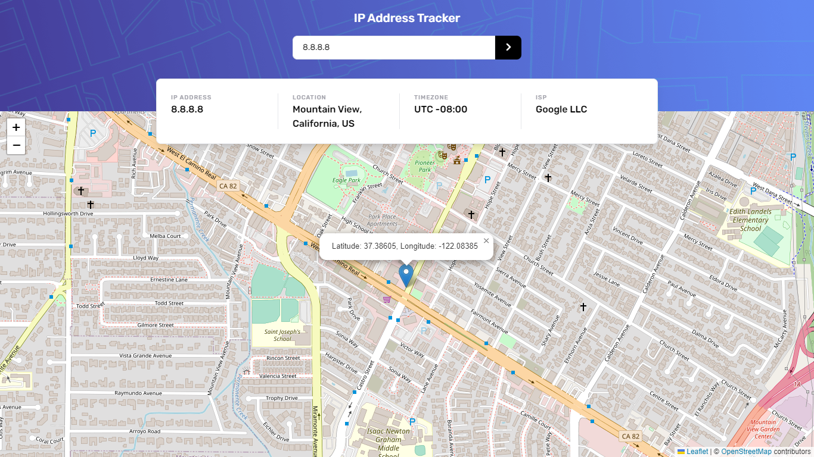
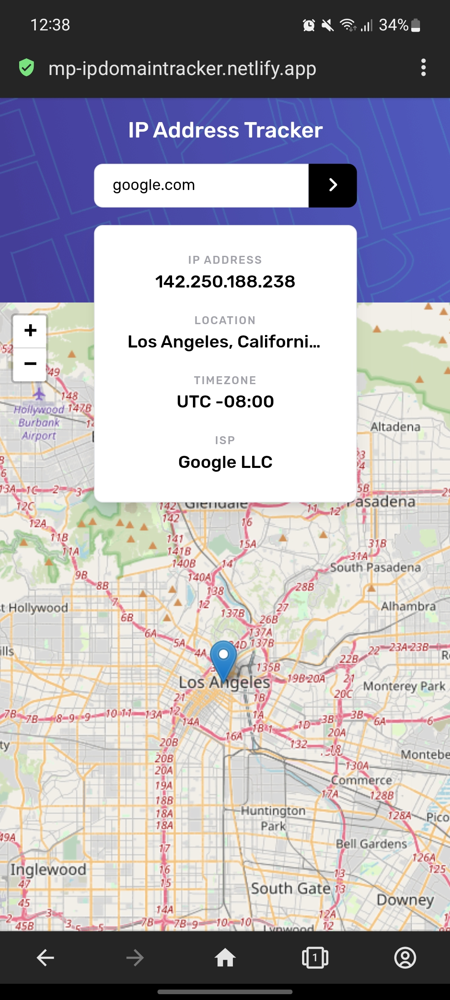

# Frontend Mentor - IP address tracker solution

This is a solution to the [IP address tracker challenge on Frontend Mentor](https://www.frontendmentor.io/challenges/ip-address-tracker-I8-0yYAH0). Frontend Mentor challenges help you improve your coding skills by building realistic projects. 

## Table of contents

- [Overview](#overview)
  - [The challenge](#the-challenge)
  - [Screenshot](#screenshot)
  - [Links](#links)
- [My process](#my-process)
  - [Built with](#built-with)
  - [Useful resources](#useful-resources)
- [How to use](#how-to-use)
- [Author](#author)

## Overview

### The challenge

Users should be able to:

- View the optimal layout for each page depending on their device's screen size
- See hover states for all interactive elements on the page
- See their own IP address on the map on the initial page load
- Search for any IP addresses or domains and see the key information and location

### Screenshot

<p align="center">
  
  
</p>

### Links

- Solution URL: [https://github.com/montteiropedro/ip-address-tracker](https://github.com/montteiropedro/ip-address-tracker)
- Live Site URL: [https://mp-ipdomaintracker.netlify.app](https://mp-ipdomaintracker.netlify.app)

## My process

### Built with

- [React](https://reactjs.org/)
- [Tailwind CSS](https://tailwindcss.com/)
- [Leaflet](https://leafletjs.com/)
- [React-Leaflet](https://react-leaflet.js.org/)

### Useful resources

These two videos helped me with the basics of React Leaflet.

- [Introduction and Displaying a Map with React Leaflet](https://youtu.be/62Y8SFi2wBk) 
- [React-Leaflet demo](https://youtu.be/290VgjkLong)

## How to use

To clone and run this application, you'll need [Git](https://git-scm.com) and [Node.js](https://nodejs.org/en/download/) (which comes with [npm](http://npmjs.com)) installed on your computer. From your command line:

```bash
# Clone this repository (via HTTPS or SSH)
$ git clone https://github.com/montteiropedro/ip-address-tracker.git
$ git clone git@github.com:montteiropedro/ip-address-tracker.git
```

Now, navigate inside the project folder. There you will find a file named `.env.example`, from it you can easily configure your environment variables. Don't forget to rename this file to `.env`, only then it will be functional.

After this we must install the project dependencies. We can do this by running the following command:  

```bash
# Install dependencies (You must do this step inside the project folder)
$ npm install
```

With the dependencies installed we can run:

```bash
# Run app in localhost
npm run dev

# Compile and Build the app
npm run build
```

## Author

- LinkedIn - [Pedro Monteiro](https://linkedin.com/in/montteiropedro/)
- Frontend Mentor - [@montteiropedro](https://www.frontendmentor.io/profile/montteiropedro)
